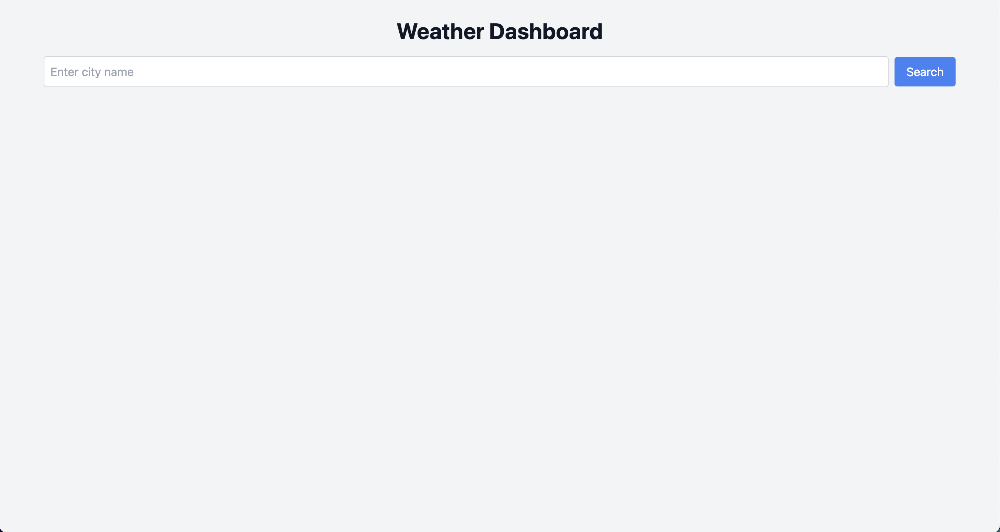
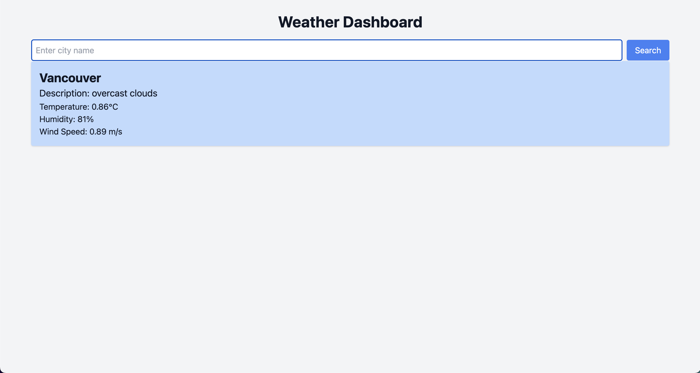

# 🌤️ Weatherly 🌎

**Weatherly** is a modern web application that provides real-time weather updates for cities worldwide. Built with a full-stack architecture, it leverages cutting-edge technologies to deliver a fast, responsive, and visually appealing user experience.

---

## 🚀 Features

- 🌟 **Live Weather Updates**: Get accurate and real-time weather data for any city.
- 🎨 **Responsive Design**: Optimized for all devices using Tailwind CSS.
- 💡 **Frontend with React & TypeScript**: Lightning-fast rendering and type-safe development.
- ⚙️ **Backend with Node.js & Express**: Scalable RESTful API for weather data.
- 🐳 **Containerized with Docker**: Ensures consistent environments across development and production.
- ☁️ **Infrastructure as Code**: Managed with Terraform for deployment on AWS ECS.
- 🔒 **Secure & Reliable**: API keys are securely managed with environment variables.

---

## 📂 Project Structure

```plaintext
weather-dashboard/
├── frontend/           # React frontend with Tailwind CSS
├── backend/            # Node.js backend for API integration
├── terraform/          # Infrastructure as Code for AWS deployment
├── docker-compose.yml  # Local development setup
└── README.md           # Project documentation
```

---

## 🛠️ Technologies Used

| **Category**    | **Tools/Technologies**                  |
|------------------|----------------------------------------|
| Frontend         | React, TypeScript, Tailwind CSS        |
| Backend          | Node.js, Express                      |
| Infrastructure   | Docker, Terraform, AWS ECS, ECR       |
| Database         | OpenWeather API (External Integration)|
| Deployment       | AWS ECS with Fargate                  |

---

## 📦 Installation & Setup

### Prerequisites
Ensure the following are installed on your machine:
- [Node.js](https://nodejs.org/)
- [Docker](https://www.docker.com/)
- [AWS CLI](https://aws.amazon.com/cli/)
- [Terraform](https://www.terraform.io/)

---

### 1️⃣ Clone the Repository
```bash
git clone git@github.com:bodhiforge/Weatherly.git
cd Weatherly
```

---

### 2️⃣ Set Up Environment Variables
Create a `.env` file in the `backend/` directory with the following:
```plaintext
PORT=4000
OPENWEATHER_API_KEY=your_openweather_api_key
```

---

### 3️⃣ Run Locally with Docker Compose
Start the application with:
```bash
docker-compose up --build
```

- Frontend: [http://localhost:3000](http://localhost:3000)
- Backend: [http://localhost:4000](http://localhost:4000)

---

### 4️⃣ Deploy to AWS

1. **Build and Push Docker Images**:
   ```bash
   aws ecr get-login-password --region us-west-2 | docker login --username AWS --password-stdin 050752643187.dkr.ecr.us-west-2.amazonaws.com
   docker build -t weather-frontend ./frontend
   docker build -t weather-backend ./backend
   docker push 050752643187.dkr.ecr.us-west-2.amazonaws.com/weather-frontend
   docker push 050752643187.dkr.ecr.us-west-2.amazonaws.com/weather-backend
   ```

2. **Deploy with Terraform**:
   ```bash
   cd terraform
   terraform init
   terraform apply
   ```

3. **Access Your Application**:
   Open the ALB DNS in your browser:
   ```
   http://<alb-dns-name>/frontend/
   http://<alb-dns-name>/backend/
   ```

---

## 📸 Screenshots

| Homepage                     | Weather Results              |
|------------------------------|-----------------------------|
|  |  |

---

## 🧩 API Endpoints

### Backend
| **Endpoint**      | **Method** | **Description**              |
|--------------------|------------|------------------------------|
| `/weather/:city`  | `GET`      | Fetch weather for a city     |
<!-- | `/health`         | `GET`      | Health check for the service | -->

---

## 🤝 Contributing

1. Fork the repository.
2. Create a feature branch: `git checkout -b my-feature`.
3. Commit your changes: `git commit -m "Add my feature"`.
4. Push to the branch: `git push origin my-feature`.
5. Open a pull request.

---

## 📄 License

This project is licensed under the MIT License.

---

## 👩‍💻 About the Author

Created with ❤️ by **Your Name**.  
Find me on [GitHub](https://github.com/bodhiforge) | [LinkedIn](https://linkedin.com/in/bodhiyang).

---

Let me know if you'd like help customizing this further! 🎉